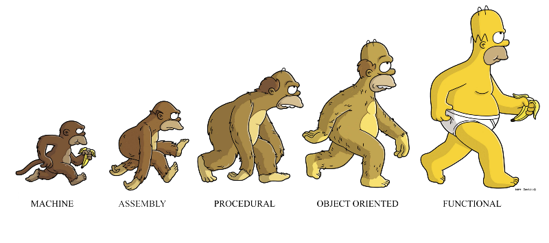

#Functional Programming



##Benefits

###Simplicity and Legibility

####With Boilerplate

```javascript
var things = [1, 2, 3, 4];
for (var i = 0; i < things.length; ++i) {
    things[i] = things[i] * 10;
}
console.log(things);
```

####No Boilerplate

```scala
var things = [1, 2, 3, 4];
var newThings = map(v => v * 10, things);
```

####With Boilerplate

```java
interface Calc {
  int operation(n, m):Integer;
}

class CalcAdds implements Calc {
  int operation(n, m) { return n + m }
}

class CalcMult implements Calc {
  int operation(n, m:Integer) { return n * m }
}

Calc sum = new CalcSum()
int result = sum.operation(1,2)

Calc mult = new CalcMult()
int result = mult.operation(1,2)
```

####No Boilerplate

```scala
object Calc {
	def calc(a:Int,b:Int,f:(Int,Int)=>Int):Int = {
   	 f(a,b)
	}
}

val result = Calc.calc(1,3,(_+_))

val result = Calc.calc(1,3,(_*_))
```

###Composibility

```scala
def twofold(n:Int) = {n * 2}

def threefold(n:Int) = {n * 3}

val sixfold = twofold _ compose threefold _

sixfold(2)
```

###Debugability

```java
int rt(int x)
{
  return x + 1;
}
```
This is easy to reason about: ```rt(6) = 6 + 1 = 7```

```java
int globalValue = 0;

int rq(int x)
{
  globalValue++;
  return x + globalValue;
}
```
This is hard to reason about: ```rq(6) = ???```

What about ```rq(x) + rq(y) * (rq(x) - rq(x))``` ?

###Quality and Robustness

Immutability, legibility, simplicity and debugability makes the code less errorprone and easier to test.

###Concurrency and Parallelism

Immutability along with Futures and Promises help avoiding common concurrency issues like race conditions and deadlocks.

###Higher Level Abstractions

Functional Programming pushes us towards thinking in terms of higher level abstractions, i.e., extract common behaviour duplicated throughout the code into higher level functions.

The most common functional abstractions are:

* map: ```(1 to 5).map(_*2)``` = Vector(2, 4, 6, 8, 10)
* flatMap ```(1 to 5).flatMap(1 to _)``` =  Vector(1, 1, 2, 1, 2, 3, 1, 2, 3, 4, 1, 2, 3, 4, 5)
* reduce ```(1 to 5).reduce(_+_)``` = 15

##Basic Concepts

###REPL

REPL stands for read, eval, print, loop. Most functional programming languages provide a REPL which can be used for rapid experimentation and prototyping.

###Anonymous Functions

Anonymous functions help increasing legibility by reducing the need for boilerplate code.

```scala
(x, y)=> x + y
```
```scala
(1 to 5).map((x) => x + 1)
```

###Currying and Partial Function Application

Currying is a method of producing a chain of functions from a function with multiple arguments. The arguments of the original function will be split into the new generated functions.

Given the mod function below:

```scala
def mod(n:Int, x:Int) = ((x % n) == 0)
```

We can define a curried version of mod like in the code snippet below:

```scala
def filter(xs: List[Int], p: Int => Boolean): List[Int] =
  if (xs.isEmpty) xs
  else if (p(xs.head)) xs.head :: filter(xs.tail, p)
  else filter(xs.tail, p)

def modCurried(n: Int)(x: Int => Boolean) = {
  (a:Int) => mod(n, a)
}

val nums = List(1, 2, 3, 4, 5, 6, 7, 8)

filter(nums, modCurried(2)_)
filter(nums, modCurried(3)_)
```

Uncurrying is the inverse of currying, i.e, we generate a function with more arguments than the originals functions.

```scala
def modUncurried(n: Int, x:Int) = {
	modCurried(n)(x)
}
```

Currying enables Partial function application, which allows a function to have some of its parameters fixed, generating a new function with lower arity. For example:

```scala
def add(x: Int, y: Int) = {x + y} 

val inc = add(1, _: Int)

val res = inc(0) //returns 1
```

###Pure Functions and Side Effects

Pure functions are functions:

1. Whose return values are only determined by its inputs.
2. Have no observable side effects.

Example of impure function:

```java
class Person {
	int age = 0;
	
	void incrementAge(years:Integer) {
	  this.age += years;
	}
}
```

Example of pure function:

```scala
def incrementAge(age:Int, years:Int) = {
	age + years;
}
```

Reading from the keyboard and writing to a display are considered side effects. The same applies for http requests and any other kind of I/O operation.

###Functions as First Class Citizens

Functions are called first class citizens when the language they are implemented allows them to be assigned to variables or stored in data structures.

```scala
val f = (x:Int,y:Int) => x * y
f(2,3)

val functionList = List((x:Int, y:Int) => x * y)
```

###Higher Order Functions

Higher order functions are functions that receive other functions as parameters and/or return other functions as results.

```scala
def saveIfValid(user:User, validations:List[(User)=>Boolean]) = {
	if (validations.forall(v => v(user))) {
		save(user)
	}
}
```
```scala
def doOperation(opType:String):(Int,Int)=>Int = {
  if (opType == "Sum")
    (a:Int,b:Int) => a + b
  else
    (a:Int,b:Int) => a * b
}

doOperation("Sum")(1,2)
doOperation("Mul")(1,2)
```

###Immutability

Immutability means that once a variable is assigned with a value of a given type, its value will never change. This is true for both scalar types and other data structures like sequences, sets and maps.

Instead of changing the value of a variable in-place, expressions using immutable variables generate a new value as the result of applying the expression to the variable.

Simple duplicating data structures like lists or vectors, could incurr in memory issues like stack overflow. To overcome this kind of issues, techniques like persistent data structures, which reuse part of the original data structures, are used.

###Closures

A closure is a function together with a referencing environment for the non-local variables of that function. A closure allows a function to access variables outside its immediate lexical scope.

A closure is a block of code which meets three criteria:

1. The block of code can be passed around as a value, and
2. It can be executed on demand by anyone who has that value, at which time, and
3. It can refer to variables from the context in which it was created (i.e. it is closed with respect to variable access, in the mathematical sense of the word “closed”).

```scala
val belowFirst  =  (xs : List[Int])  =>  { 
    val first = xs( 0 )
 
    val isBelow  =  ( y : Int )  =>   y < first
 
    for(  x <- xs;  if(  isBelow( x )  )  yield x
}

belowFirst( List( 5, 1, 7, 4, 9, 11, 3 ) ) // => List( 1, 4, 3 )
```

###Recursion

Recursion is the functional alternative to for loops. Depending on the implementation, recursion can be more efficient than traditional loops.

```scala
def factorial(n: Int): Int = {
  if (n == 0) 
    return 1
  else
    return n * factorial(n-1)
}
```

###Lazy Sequences

Lazy sequences are sequences whose items are evaluated on demand. It allows us to work with very large sequences and even infinite sequences without raising stack overflow errors.

```scala
List("a", "b", "c") zip (Stream from 1)
```

A lazy factorial implementation using an infinite sequence.

```scala
def factorial: Stream[BigInt] = {
  1 #:: (factorial zip Stream.from(1)).map(x => x._1 * x._2)
}
```

###Functional Abstractions

* Map - Consists in creating a new sequence by applying a function to each item from the original sequence.

```scala
(1 to 10).map(_ * 2)
```

* FlatMap - Similar to map, but the function to be applied must return a sequence, instead of a scalar (single value). It will result in a sequence of sequences which are then flattened into a single list.

```scala
(1 to 10).flatMap(0 to _)
```

* Fold - As in map, applies a function to each item of a sequence. The function to be applied must accept a second parameter (called seed) of any type, and return a value of this very same type. The result of the function is used as the seed for the subsequent calls.

```scala
(1 to 10).foldLeft(Nil:List[Int])((a,b) => b :: a)
```

* Reduce - A specialization of fold, where the seed type has the same type of the items in the sequence, and the result is  a single value "reduced" by the given function.

```scala
(1 to 10).reduce(_+_)
```

##Advanced Concepts

###Tail Recursion

In order for a recursive call to be tail recursive, the call back to the function must be the last action performed in the function.

A non tail recursive function needs to save intermediate results for each nested function call, which can cause stack overflow errors if there are many nested calls.

First a non tail recursive function:

```scala
def factorial(number:Int) : Int = {
    if (number == 1)
       return 1
    number * factorial (number - 1)
}
```

Now, a tail recursive implementation:

```scala
def factorial(accumulator: Int, number: Int) : Int = {
  if(number == 1)
    accumulator
  factorial(number * accumulator, number - 1)
}
```

###Pattern Matching

Pattern matching is a very powerful feature which allows code to be written in a more elegant manner, specially when using concomitantly with recursion.

```scala
def factorial(number: Int, accumulator: Int = 1) : Int = number match {
    case 1 => accumulator
    case _ => factorial(number - 1, number * accumulator)
}
```

Here's an example of pattern matching on Lists.

```scala
def foldLeft[A, B](l: List[A], z: B)(f: (B, A) => B): B = l match {
    case Nil => z
    case (x :: xs) => foldLeft(xs, f(z, x))(f)
}
```

###Algebraic Data Types

An algebraic data type is a kind of composite type, i.e., a type formed by combining other types.

Two common classes of algebraic types are product types (i.e., tuples and records) and sum types.

Examples of product types are tuples and classes:

```
type Person = (String, Int)

class ScalaPerson(val name: String, val age: Int)
```

Here's an example of a sum type achieved by using subclassing:

```scala
sealed trait Pet
case class Cat(name: String) extends Pet
case class Fish(name: String, color: Color) extends Pet
case class Squid(name: String, age: Int) extends Pet

val bob: Pet = Cat("Bob")
```

Values of algebraic types are analyzed with pattern matching, which identifies a value by its constructor or field names and extracts the data it contains.

```scala
def sayHi(p: Pet): String = p match {
    case Cat(n)      => "Meow " + n + "!"
    case Fish(n, _)  => "Hello fishy " + n + "."    
    case Squid(n, _) => "Hi " + n + "."    
}

scala> sayHi(Cat("Bob"))
res0: String = Meow Bob!

scala> sayHi(Squid("Steve", 10))
res1: String = Hi Steve.
```

Lists are also an algebraic data type of the type sum type. That's why we can use pattern matching to destructure a list by using its constructors :: (Cons) and Nil.

###Monoids and Monads

####Monoids

#####Definition

A monoid is "a bunch of things" and "some way of combining them".

For example: 

* "integers under addition" is a monoid.
* "strings (or lists) under concatenation" is a monoid.

To be considered a monoid, the combining operation must met the following rules:

1. Rule 1 (Closure): The result of combining two things is always another one of the things. Ex: 1 + 2 = 3
2. Rule 2 (Associativity): When combining more than two things, which pairwise combination you do first doesn't matter. Ex: (1 + 2) + 3 = 1 + (2 + 3)
3. Rule 3 (Identity element): There is a special thing called "zero" such that when you combine any thing with "zero" you get the original thing back. Ex: 3 * 1 = 3 or "test" + "" = "test"

#####Benefits

1. Closure: The closure rule has the benefit that you can convert pairwise operations into operations that work on lists or sequences. In other words, if we can define a pairwise operation, we can extend it to list operations "for free".

The function that does this is typically called "reduce".

```scala
List(1,2,3,4).reduce(_+_)
res1: Int = 10
```

You can see that reduce can be thought of as inserting the specified operation between each element of the list.

2. Associativity: If the pairwise combinations can be done in any order, that opens up some interesting implementation techniques, such as:

* Divide and conquer algorithms
* Parallelization
* Incrementalism

3. Identity: Having an identity element is not always required. Having a closed and associative operation is sufficient to do many useful things. However, in some cases, it is not enough. For example, here are some cases that might crop up:

* How can I use reduce on an empty list?
* If I am designing a divide and conquer algorithm, what should I do if one of the "divide" steps has nothing in it?
* When using an incremental algorithm, what value should I start with when I have no data?

In all cases we need a "zero" value. This allows us to say, for example, that the sum of an empty list is 0.

#####Conclusion

It's important to understand that it's possible to create our own monoidic types for real life entities like Orders, Customers, Products and so on.

By doing that, we can leverage the builtin operations that already know how to work with monoids. From just simplifying our code to enabling parallelism, monoids are a powerful feature of functional programming languages.

####Monads

#####Definition

One can think about monads **like** being:

* A wrapper for an object.
* An interface with two operations to be implemented.
* A parametric type.
* Monad is not a class or a trait; monad is a concept. Every “wrapper” that provides us with our two operations, unit and flatMap, is essentially a monad.

The two functions a monad must implemented are called:

* identity (or unit)
* bind (or flatMap)

The unit function simply performs the wrapping part, i.e., encapsulates the object in a monad of the object's type.

```scala
val listMonad = List(1)
val optionMonad = Some(1)
val setMonad = Set(1)
```

The flatMap function allows us to transform the object wrapped by a monad. The result of applying flatMap is also a monad of the same type.

```scala
listMonad.flatMap((x) => List(x+1))
optionMonad.flatMap((x)=>Some(x+1))
```

For completeness, it's necessary to mention that in order to be considered a monad, the parametric type needs to conform with the following laws:

* lef-identity law: ```unit(x).flatMap(f) == f(x)```
* right-identity law: ```m.flatMap(unit) == m```
* associativity law: ```m.flatMap(f).flatMap(g) == m.flatMap(x ⇒ f(x).flatMap(g))```


#####Benefits

Monads help avoiding boilerplate code and also enables composition by removing the need for things like null checks and exception handling.

Here's an example of a program which takes advantage of the Option monad to avoid null checks and exception handling:

```scala
trait User {
  val child: Option[User]
}

object UserService {
  def loadUser(name: String): Option[User] = { /** get user **/ }  
}

val getChild = (user: User) => user.child

val result = UserService.loadUser("mike")
  .flatMap(getChild)
  .flatMap(getChild)
```

When using monads, some languages will provide you with some syntactic sugar to operate on them:

```scala
val result = for {
  user             <- UserService.loadUser("mike)
  usersChild       <- user.child
  usersGrandChild  <- usersChild.child
} yield usersGrandChild
```

Another application of monads, now using the Future monad. Let's start with the domain model and services:

```scala
// needed for Futures to work
import scala.concurrent.Future
import scala.concurrent.ExecutionContext.Implicits.global

trait Order
trait Item
trait PurchaseResult
trait LogResult

object OrderService {  
  def loadOrder(username: String): Future[Order] 
}
object ItemService {  
  def loadItem(order: Order): Future[Item] 
}
object PurchasingService { 
  def purchaseItem(item: Item): Future[PurchaseResult]
  def logPurchase(purchaseResult: PurchaseResult): Future[LogResult] 
}
```

Nos let's create some functions to call our services:

```scala
val loadItem: Order => Future[Item] = {
  order => ItemService.loadItem(order)
}
val purchaseItem: Item => Future[PurchaseResult] = {
  item => PurchasingService.purchaseItem(item)
}

val logPurchase: PurchaseResult => Future[LogResult] = {
  purchaseResult => PurchasingService.logPurchase(purchaseResult)
}
```

Finally, let's chain everything together.

```scala
val result = 
  OrderService.loadOrder("customerUsername")
  .flatMap(loadItem)
  .flatMap(purchaseItem)
  .flatMap(logPurchase)
```

Once again, by using monads we can leverage the for comprehension syntactic sugar (in Scala).

```scala
val result =
  for {
    loadedOrder    <- orderService.loadOrder(“customerUsername”)
    loadedItem     <- itemService.loadItem(loadedOrder)
    purchaseResult <- purchasingService.purchaseItem(loadedItem)
    logResult      <- purchasingService.logPurchase(purchaseResult)
  } yield logResult
```
#####Conclusion

Monads with its two operations, unit and flatMap, is a pretty powerful feature. Forget entangled if-branches, nested loops with their off-by-one errors and the callback hell. Monads enable you to write simpler and cleaner code, which often leads to less bugs in production.

Just like monoids, beyond using the existing monads, we can create our own in order to make our codebase simpler and more elegant.

##Examples

###Monads - Options and Lists

* Scala
* Haskell
* Clojure
* Swift

###Concurrency and Parallelism - Futures and Promises

* Scala
* Haskell
* Clojure
* Swift


